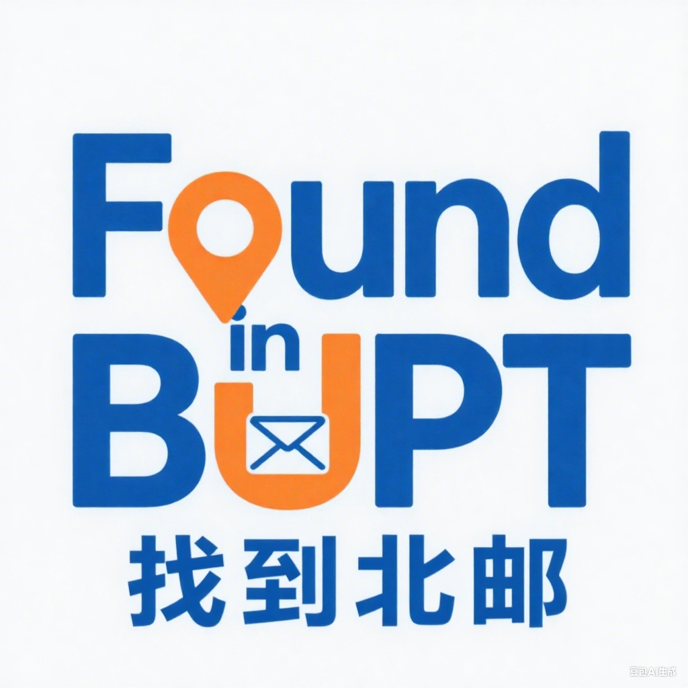

# 校园失物招领平台 - Found In BUPT

---



## 🌟 项目简介

**找到北邮 (Found In BUPT)** 是一个专为大学校园场景设计的现代化、功能丰富的失物招领网络平台。针对大学校园内师生频繁丢失或拾获物品，但信息流通不畅、寻回效率低下的问题，本项目旨在通过技术手段，打造一个集信息发布、智能检索、实时匹配与私信沟通于一体的高效解决方案。

平台不仅简化了失物招领的流程，更通过引入**大语言模型（LLM）智能匹配**、**多角色权限管理**和**人性化的交互设计**，极大地提升了物品归还的成功率和用户体验，构建了一个更加温暖、互助的校园社区。

---

## ✨ 项目特色

本平台不仅涵盖了失物招领应用的基础功能，更在以下几个方面进行了深入的创新和优化，形成了独特的核心竞争力：

### 1. **🤖 大语言模型（LLM）驱动的智能匹配**
平台最大的亮点是集成了先进的大语言模型（LLM）技术，用于物品的智能匹配。
- **双向匹配**：当用户发布新的“失物”信息时，系统会自动在“拾物”数据库中进行检索和匹配；反之亦然。
- **高精度语义分析**：不同于传统的关键词匹配，LLM能够理解物品描述的深层语义，例如“一个黑色的苹果手机”和“一台iPhone，深空灰色”，模型能够判断其高度相似性。
- **上下文感知**：匹配时会综合考虑物品名称、类别、颜色、地点和详细描述等多个维度，提供远超手动搜索的精准推荐。
- **志愿者辅助**：志愿者和管理员拥有专属的“AI智能匹配”功能，可以主动为任何“未找到”的物品触发智能匹配，并辅助双方建立联系，大大提升了服务效率和覆盖面。

### 2. **🗺️ 深度集成校园地图，实现精准定位与筛选**
为了更直观地展示物品丢失或拾获的位置，平台深度集成了校园地图功能。
- **地图选点发布**：用户在发布信息时，可以直接在校园地图上点击选择精确的楼宇或区域（如“西土城校区：教三楼”或“沙河校区：图书馆”），免去了手动输入的繁琐和不准确。
- **地图筛选查找**：在主页的寻物和拾物墙，用户可以通过点击“地图筛选”按钮，快速查找特定区域内的所有失物/拾物信息，让寻找过程更加聚焦。

### 3. **💬 安全私密的即时通讯系统**
为了保护用户的个人隐私，平台内置了一套完整的站内信（即时通讯）系统。
- **匿名沟通**：用户在对感兴趣的物品进行沟通时，无需公开自己的电话、微信等联系方式，所有交流都在平台内完成，有效避免了信息泄露和骚扰风险。
- **多媒体消息**：聊天不仅支持文字，还支持**图片上传**功能。失主可以发送参考图片，拾主可以拍摄物品细节照片，让沟通更加高效直观。
- **对话管理**：提供完整的对话列表和聊天窗口，用户可以轻松管理自己的所有对话。同时，失主在确认找到物品后，可以主动完结对话，标记物品状态。

### 4. **👥 多角色权限与精细化管理**
系统设计了三种不同的用户角色（普通用户、志愿者、管理员），每种角色拥有不同的权限和视图，实现了平台的精细化、安全化运营。
- **普通用户**：核心功能的使用者，可以发布、编辑、删除自己的失物/拾物信息，并与其他用户进行私信沟通。
- **志愿者**：平台的协作者，拥有专属的“志愿者中心”，可以查看所有待匹配的物品，并使用“AI智能匹配”功能帮助失主和拾主建立联系。
- **管理员**：平台的最高管理者，拥有“管理后台”的访问权限，可以对平台的所有用户、所有物品信息进行增、删、改、查等操作，确保平台内容健康、有序。

### 5. **🔔 完善的实时通知系统**
为了确保用户不会错过任何重要信息，平台建立了一套包含站内信和邮件提醒的立体化通知系统。
- **站内通知**：当用户的物品有了新的匹配、收到新的私信，或个人信息被修改时，系统会发送站内通知，并在导航栏以小红点提示。
- **邮件提醒**：对于重要事件，如物品成功匹配，系统会自动向双方用户的注册邮箱发送邮件，进行二次提醒，确保信息触达。
- **密码安全**：支持通过邮箱验证码进行密码重置，保障账户安全。

---

## 🛠️ 技术栈

本项目采用前后端分离的现代化Web架构，确保了系统的高内聚、低耦合和良好的可扩展性。

- **后端 (`backend`)**:
    - **框架**: `Flask` (一个轻量级的Python Web框架)
    - **数据库**: `SQL Server` (通过 `pyodbc` 连接)
    - **AI模型**: `DashScope` (通义千问系列模型)
    - **邮件服务**: `Flask-Mail`
    - **其他**: `python-dotenv` (环境变量管理), `Werkzeug` (安全文件名处理)

- **前端 (`frontend`)**:
    - **核心技术**: `HTML5`, `CSS3`, `JavaScript (ES6+)`
    - **UI框架与库**: `Tailwind CSS` (功能类优先的CSS框架), `Bootstrap` (用于登录/注册页面)
    - **图标**: `Font Awesome`
    - **交互**: 原生JavaScript实现，无大型前端框架依赖，轻量且高效。

- **数据库 (`database`)**:
    - `setup.sql`: 提供了完整的数据库表结构创建和初始数据填充的SQL脚本，方便一键部署。

---

## 📂 项目结构

```
📁 backend/
    📄 app.py					# Flask后端主应用
📁 database/
    📄 setup.sql				# 数据库初始化脚本
📁 frontend/
    📁 assets/
        📁 css/					# 样式文件
            📄 login.css
            📄 register.css
            📄 style.css
        📁 images/				# 静态图片资源
            📄 campus.png
        📁 js/					# 核心交互脚本
            📄 script.js
    📁 uploads/					# 用户上传的图片（物品图片、聊天图片）
    📄 admin.html				# 管理员后台
    📄 chat.html				# 聊天列表页
    📄 index.html				# 主页（信息墙）
    📄 login.html				# 登录页
    📄 personal.html			# 个人中心
    📄 register.html			# 注册页
    📄 volunteer.html			# 志愿者中心
📄 requirements.txt				# Python依赖包列表
📄 README.md					# 项目说明文档 (本文)
```

---

## 🚀 快速开始

### 1. 环境准备

- 安装 `Python 3.x`
- 安装 `SQL Server` 并确保其正在运行
- 一个支持 `SMTP` 的邮箱账号（用于邮件提醒功能）

### 2. 后端部署

1.  **克隆/下载项目到本地**

2.  **安装Python依赖**:
    ```bash
    pip install -r requirements.txt
    ```

3.  **配置数据库**:
    - 打开 `SQL Server Management Studio` 或其他数据库客户端。
    - 运行 `database/setup.sql` 脚本，这将创建 `LostAndFoundDB` 数据库、所有表结构并插入初始数据。

4.  **配置环境变量**:
    - 在 `backend` 目录下创建一个名为 `.env` 的文件。
    - 在 `.env` 文件中配置以下内容：
      ```env
      # 大语言模型API密钥和基础URL
      LLM_API_KEY="sk-xxxxxxxxxxxxxxxxxxxxxxxxxxxxxxxx"
      LLM_BASE_URL="[https://dashscope.aliyuncs.com/compatible-mode/v1](https://dashscope.aliyuncs.com/compatible-mode/v1)"
      
      # 数据库驱动（根据你的系统和SQL Server版本可能需要调整）
      DB_DRIVER="ODBC Driver 17 for SQL Server"
      ```

5.  **运行后端服务**:
    ```bash
    cd backend
    python app.py
    ```
    服务将在 `http://localhost:8000` 启动。

### 3. 前端访问

- 在浏览器中直接打开 `frontend` 目录下的 `login.html` 文件，或通过 `http://127.0.0.1:8000` 访问（后端会自动重定向）。
- **默认管理员账号**: `admin` / `admin123`
- **默认志愿者账号**: `volunteer1` / `volunteer123`
- **默认普通用户账号**: `user1` / `11111111`

---

## 📝 使用说明

1.  **注册/登录**：新用户通过注册页面创建账户，老用户直接登录。
2.  **浏览信息**：在主页 `index.html` 的“寻物启事”和“拾物招领”板块浏览物品信息，可以使用关键词、分类或地图进行筛选。
3.  **发布信息**：点击右上角的“发布信息”按钮，填写物品详情并提交。捡到物品必须上传图片。
4.  **认领物品**：在“拾物招领”中找到疑似自己丢失的物品，点击“认领”并发起私信。
5.  **即时沟通**：通过导航栏的“聊天”或通知提醒进入聊天页面，与对方沟通确认物品细节。
6.  **管理个人信息**：在“个人中心”可以查看和编辑自己发布的所有信息，修改个人资料和密码。
7.  **智能匹配**：在个人中心，可以对自己“未找到”的物品点击“大模型智能匹配”，系统将推荐高度相似的物品。

---

感谢使用！希望 **Found In BUPT** 能为您的校园生活带来便利。